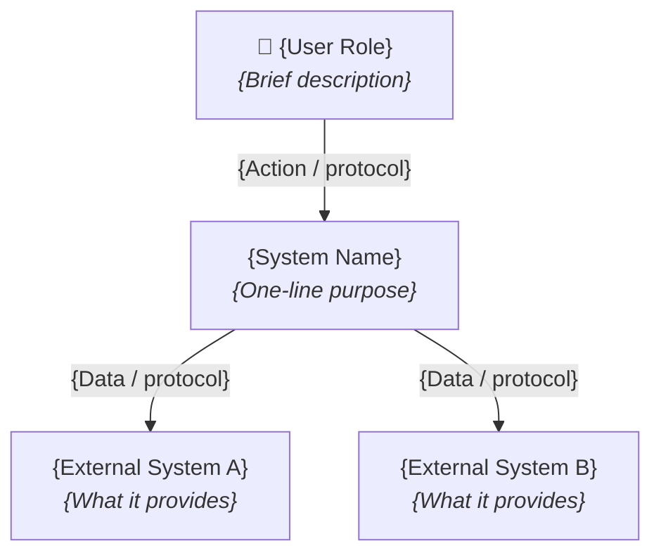
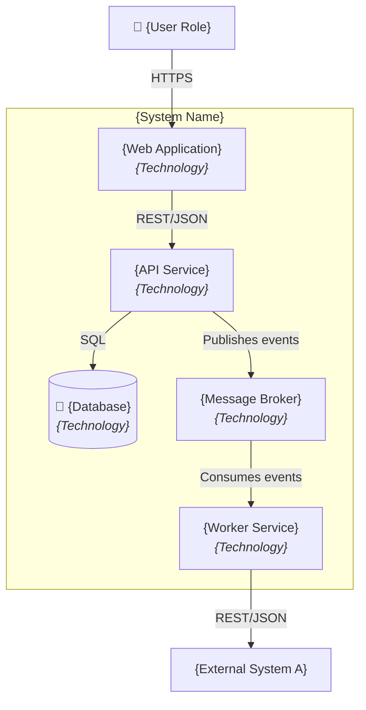
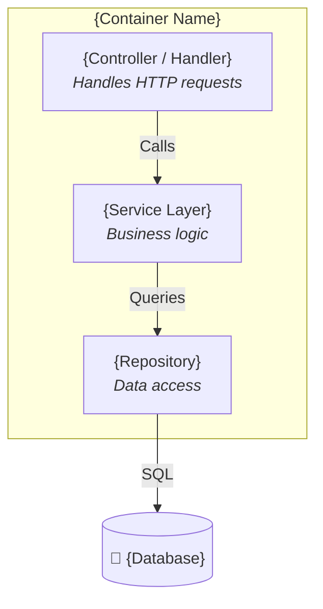

# C4 Diagram Template

Use this template to create C4 model diagrams in Mermaid syntax. Start with the Context diagram, then drill into Container and Component levels as needed. All diagrams render natively in GitHub, VS Code, and most documentation platforms.

---

## Level 1 — System Context Diagram

Shows the system under design, its users, and external systems it depends on or integrates with.

### Usage Notes — Context Diagram

- Replace all `{placeholders}` with real names and descriptions.
- Add or remove actors and external systems as needed.
- Annotate arrows with the interaction type and protocol (e.g., `REST/JSON`, `SMTP`, `SQL`).
- Keep this diagram high-level — no internal components.

---

## Level 2 — Container Diagram

Shows the major containers (applications, services, databases, message brokers) inside the system boundary.

### Usage Notes — Container Diagram

- Each container should list its technology in italics.
- Use database cylinder notation `("💾 ...")` for data stores.
- Show communication protocols on all arrows.
- Group all containers inside a `subgraph` labeled with the system name.

---

## Level 3 — Component Diagram (optional)

Shows key components inside a single container. Use only when the internal structure of a container needs to be communicated.

---

## Best Practices

- **Start at Context, zoom in only as needed.** Not every system needs a Component diagram.
- **One diagram per level per scope.** If a container diagram gets too crowded, split by subdomain.
- **Label everything.** Every box has a name, technology, and short description. Every arrow has a protocol or data annotation.
- **Keep diagrams in source control** alongside the code, typically in `docs/architecture/` or `architecture/diagrams/`.
- **Update diagrams when architecture changes.** Stale diagrams are worse than no diagrams.
