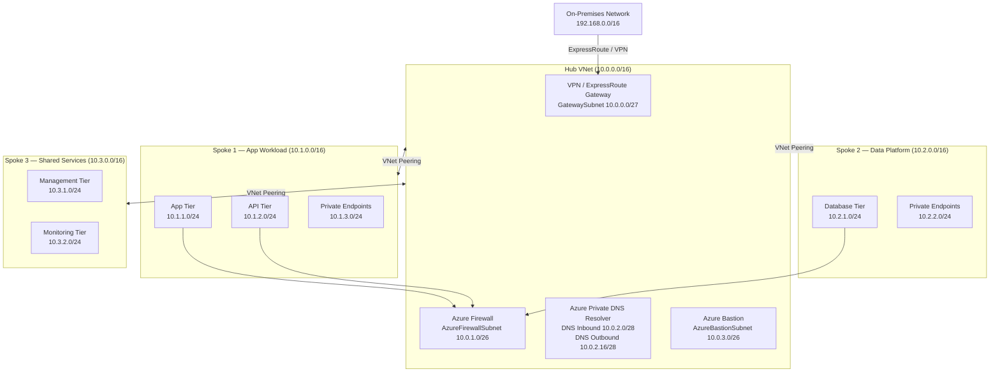

# Hub-Spoke Topology Template

Use this template to document an Azure hub-spoke VNet topology as a Mermaid diagram.
Replace placeholder names and CIDR ranges with values specific to the workload.

## Mermaid Diagram

## Peering Configuration

| Peering | Allow forwarded traffic | Allow gateway transit | Use remote gateways |
|---|---|---|---|
| Hub → Spoke 1 | Yes | Yes | No |
| Spoke 1 → Hub | Yes | No | Yes |
| Hub → Spoke 2 | Yes | Yes | No |
| Spoke 2 → Hub | Yes | No | Yes |
| Hub → Spoke 3 | Yes | Yes | No |
| Spoke 3 → Hub | Yes | No | Yes |

> **Note:** Enable `Allow gateway transit` only on the hub side of each peering.
> Enable `Use remote gateways` only on spoke sides to route through the hub gateway.

## Design Decisions

| Decision | Choice | Rationale |
|---|---|---|
| Internet egress | Azure Firewall in hub | Centralised inspection and logging |
| DNS resolution | Azure Private DNS Resolver | Supports on-premises conditional forwarding |
| Bastion | Hub-deployed Azure Bastion | Single jump host for all spokes |
| Spoke isolation | No spoke-to-spoke peering | All cross-spoke traffic via hub firewall |
