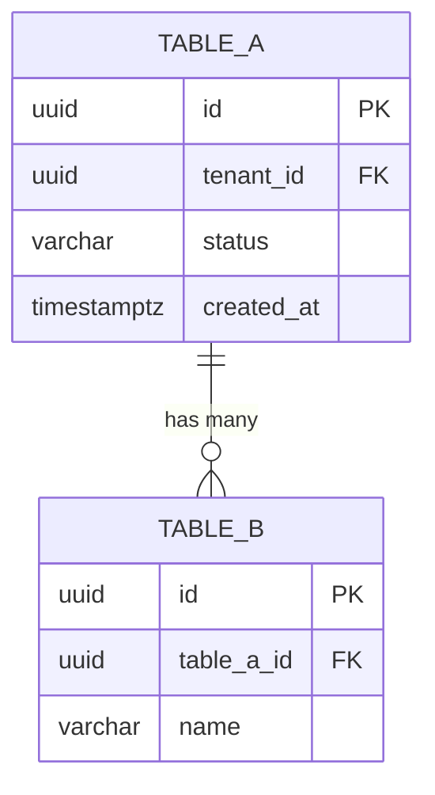

# Schema Design Template

Use this template to document a database schema before implementation. Complete all sections. A schema document prevents ambiguous migrations and missing constraints.

---

## Schema Overview

| Field | Value |
|---|---|
| **Domain / Service** | `<service or bounded context name>` |
| **Database type** | PostgreSQL / MySQL / SQL Server / SQLite / Other |
| **Multi-tenant** | Yes (tenant isolation via `tenant_id` column) / No |
| **Soft delete** | Yes (`deleted_at` column) / No |
| **Author** | `<name or team>` |
| **Last Updated** | `YYYY-MM-DD` |

---

## Entities

List every table or entity. For each entity, describe its purpose in one sentence.

| Entity (Table Name) | Purpose |
|---|---|
| `<table_name>` | <one-sentence description> |
| `<table_name>` | <one-sentence description> |

---

## Entity Detail: `<table_name>`

Repeat this section for every entity.

### Columns

| Column | Type | Nullable | Default | Description |
|---|---|---|---|---|
| `id` | `UUID` / `BIGINT` | No | `gen_random_uuid()` / auto-increment | Primary key |
| `tenant_id` | `UUID` | No | — | Multi-tenant isolation key |
| `<column_name>` | `VARCHAR(255)` | No | — | Description of this column |
| `<column_name>` | `DECIMAL(19,4)` | No | `0.00` | Monetary amount in native currency |
| `<column_name>` | `BOOLEAN` | No | `false` | Whether the record is active |
| `<column_name>` | `TEXT` | Yes | `NULL` | Optional long-form content |
| `status` | `VARCHAR(50)` | No | `'pending'` | Enum: `pending`, `active`, `closed` |
| `created_at` | `TIMESTAMPTZ` | No | `NOW()` | Record creation time, UTC |
| `updated_at` | `TIMESTAMPTZ` | No | `NOW()` | Last modification time, UTC |
| `deleted_at` | `TIMESTAMPTZ` | Yes | `NULL` | Soft delete timestamp; NULL = not deleted |

### Constraints

| Constraint | Type | Definition |
|---|---|---|
| `<table>_pkey` | PRIMARY KEY | `(id)` |
| `<table>_tenant_id_fkey` | FOREIGN KEY | `(tenant_id) REFERENCES tenants(id) ON DELETE CASCADE` |
| `<table>_<column>_fkey` | FOREIGN KEY | `(<column>) REFERENCES <other_table>(id) ON DELETE RESTRICT` |
| `<table>_status_check` | CHECK | `status IN ('pending', 'active', 'closed')` |
| `<table>_<column>_not_negative` | CHECK | `<column> >= 0` |
| `<table>_<columns>_unique` | UNIQUE | `(tenant_id, <natural_key_column>)` |

### Indexes

| Index Name | Columns | Type | Rationale |
|---|---|---|---|
| `<table>_tenant_id_idx` | `(tenant_id)` | B-Tree | All queries filter by tenant |
| `<table>_<fk>_idx` | `(<fk_column>)` | B-Tree | Every FK column gets an index |
| `<table>_created_at_idx` | `(created_at DESC)` | B-Tree | Feed queries sorted by newest first |
| `<table>_status_tenant_idx` | `(tenant_id, status)` | B-Tree | Composite for multi-tenant status filter queries |

### Notes

Document any non-obvious design decisions for this table.

- Why this normalization level was chosen
- Any planned denormalization and its justification
- Soft delete policy and filter expectations
- Audit or compliance requirements affecting this table

---

## Relationships

Describe relationships between entities.

| Relationship | Type | Notes |
|---|---|---|
| `<table_a>` → `<table_b>` | One-to-many | Each `<table_a>` record has many `<table_b>` records |
| `<table_b>` → `<table_c>` | Many-to-one | Each `<table_b>` belongs to one `<table_c>` |
| `<table_a>` ↔ `<table_c>` | Many-to-many | Via join table `<table_a_table_c>` |

---

## Entity Relationship Diagram (ERD)

Sketch the relationships in ASCII or Mermaid syntax.

---

## Open Questions

List schema decisions that need stakeholder input before the migration is written.

1. `<open question>`
2. `<open question>`
